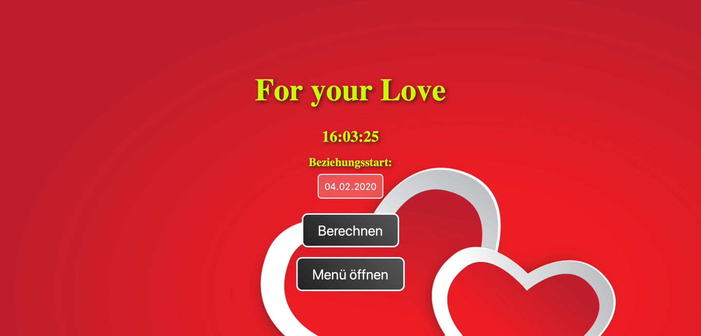
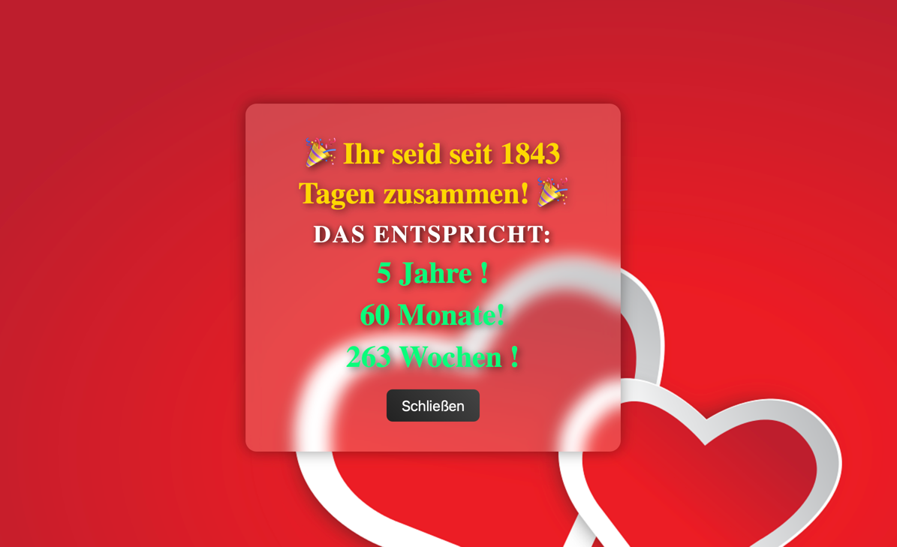

# 📌 Fun Website

## 🚀 Beschreibung

Diese Webseite zeigt verschiedene interaktive Funktionen an, darunter:

📅 Tage,Wochen,Monate und Jahre zusammen – Zeigt an, wie lange jemand mit sein Patner/in zusammen ist.

⏰ Laufende Uhrzeit – Aktualisiert sich jede Sekunde (Im Main Screen zu sehen)

## 🔧 Installation & Nutzung

Clone das Repository

git clone https://github.com/Altonbekolli/forYourLove.git

Wechsle ins Projektverzeichnis

cd forYourLove

Öffne die main.html in einem Browser

## 🤝 Mitwirken

Falls du coole Features hinzufügen willst, erstelle einfach einen Pull Request! 😎

## 📜 Lizenz

MIT License – Frei zur Nutzung und Anpassung.

